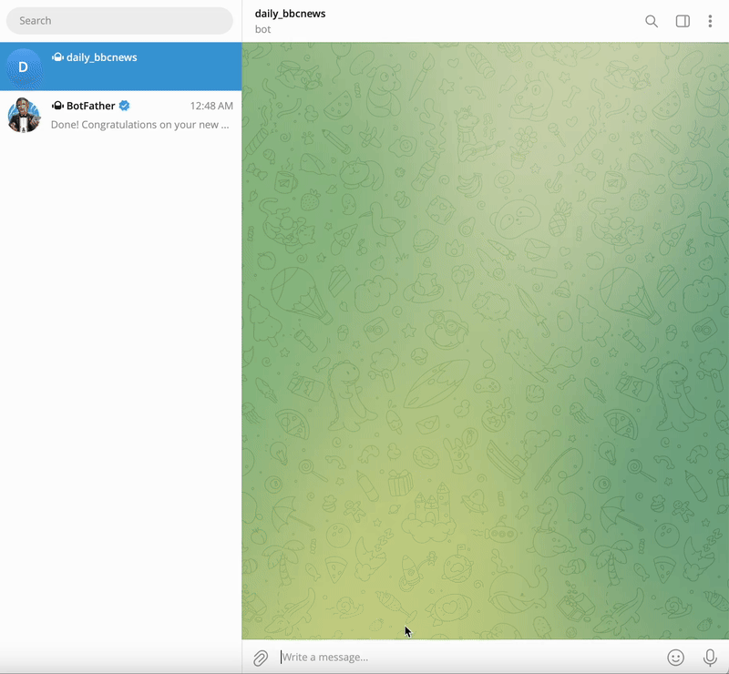

# 📰 BBC News Summarizer Telegram Bot 🤖

This project is a fully functional Telegram bot that fetches the latest BBC news articles, summarizes them using OpenAI's GPT models, and replies directly to users who message it with the keyword "news".

---

## 🚀 Features

- Scrapes the BBC News homepage to retrieve the latest headlines.
- Summarizes full articles using OpenAI's `gpt-4o-mini` model.
- Responds to Telegram users when they send the word "news".
- Sends links to the original articles along with intelligent summaries.
- Handles edge cases and errors gracefully, skipping broken or unparseable articles.

---

## 💡 How It Works

1. **User Interaction**: 
   - The user sends a message asking for `news` to the Telegram bot.
2. **Scraping Logic**:
   - The bot uses `requests` and `BeautifulSoup` to scrape the latest BBC articles.
3. **Summarization**:
   - It builds a custom prompt for each article and uses OpenAI's ChatCompletion API to generate a concise summary.
4. **Telegram Bot API**:
   - Built using the `python-telegram-bot` async framework to handle user interactions.

---

## Tech Stack

- Python 3.11+
- [python-telegram-bot (v20+)](https://github.com/python-telegram-bot/python-telegram-bot)
- [OpenAI GPT-4o](https://openai.com/)
- `requests` and `beautifulsoup4` for web scraping
- Async I/O for efficient message handling

---

## Setup Instructions

1. **Clone this repo**:
    ```bash
    git clone https://github.com/yourusername/bbc-news-summary-bot.git
    cd bbc-news-summary-bot
    ```

2. **Install dependencies**:
    ```bash
    pip install -r requirements.txt
    ```

3. **Set up environment variables**:
    Create a `.env` file (or manually export):
    ```env
    TELEGRAM_BOT_TOKEN=your-telegram-bot-token
    OPENAI_API_KEY=your-openai-api-key
    ```

4. **Run the bot**:
    ```bash
    python bot.py
    ```

---

## 🖼️ Demo

<p align="center">
  
</p>

---


## License

This project is licensed under the MIT License. See the [LICENSE](LICENSE) file for details.

---

## Contributing

Pull requests and feature suggestions are welcome. For major changes, please open an issue first to discuss what you’d like to change.

---


